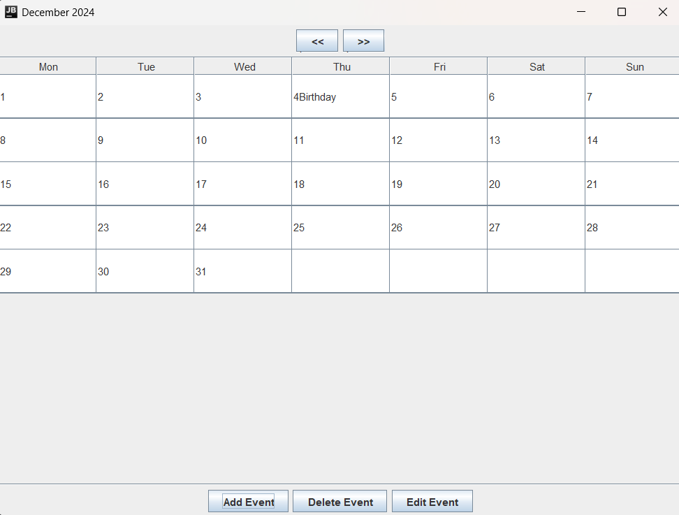

# Monthly Calendar with Events

## 📝 Description
**Task10** is a Java Swing-based monthly calendar application that allows users to:
- Navigate between months.
- Add, edit, and delete events for specific dates.
- View events directly within the calendar.

This project provides a visually organized and functional interface for basic event management tied to a monthly calendar.

---

## 🚀 Features
- **Monthly View**: Displays the current month's calendar.
- **Event Management**:
  - Add events by selecting a date and entering an event name.
  - Edit existing events to update their details.
  - Delete events from the calendar.
- **Month Navigation**: Use `<<` and `>>` buttons to move between months.
- **Dynamic Updates**: Events are displayed directly within the corresponding calendar cells.

---

## 🖥️ Technologies Used
- **Java Swing**: For the graphical user interface.
- **Java Collections**: To manage events dynamically.
- **Date and Time APIs**: For date manipulation and formatting using `java.time`.

---

## 📸 Screenshot



---

## 🛠️ How to Run
1. Clone this repository:
   ```bash
   git clone https://github.com/your-username/task10-calendar.git
   ```
2. Navigate to the project directory:
   ```bash
   cd task10-calendar
   ```
3. Compile the Java program:
   ```bash
   javac Task10.java
   ```
4. Run the application:
   ```bash
   java Task10
   ```

---

## 🧮 How to Use
1. **Navigate Months**:
   - Use the `<<` button to view the previous month.
   - Use the `>>` button to view the next month.
2. **Add an Event**:
   - Select a date by clicking a cell in the calendar.
   - Click the **Add Event** button.
   - Enter the event name in the pop-up dialog and click OK.
3. **Edit an Event**:
   - Select the date with the event to edit.
   - Click the **Edit Event** button.
   - Update the event name in the dialog and click OK.
4. **Delete an Event**:
   - Select the date with the event to delete.
   - Click the **Delete Event** button to remove it.
5. **View Events**:
   - Events are displayed directly in the corresponding calendar cell.

---

## 📂 Project Structure
```
.
├── Task10.java         # Main application file
├── README.md           # Project documentation
└── screenshot.png      # Screenshot of the application (to be added)
```
